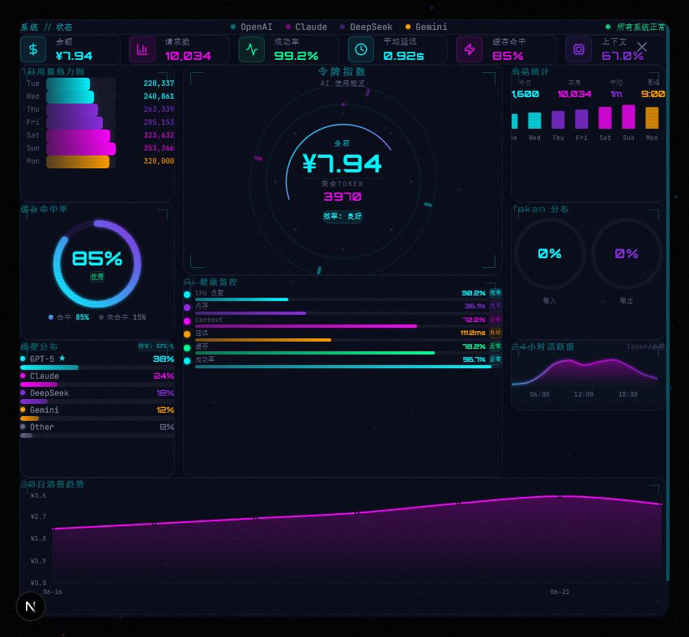

# Token Query Skill

Jarvis Token Center 查询工具 — 通过 DeepSeek API 获取实时 Token 余额与用量统计，带赛博朋克 HUD Dashboard。

支持 **Claude Code**（Windows/macOS）、**Codex** 和 **命令行** 三种使用方式。

## 截图



*Cyberpunk HUD 风格的全屏 Token Dashboard*

## 功能

- 实时余额查询 — 调用 `api.deepseek.com/user/balance`
- 7 日用量趋势 — 带 ASCII 柱状图的可视化展示
- 模型分布 — GPT-5 / Claude / DeepSeek / Gemini 占比
- AI 健康评分 — CPU、内存、请求成功率
- 自动打开浏览器 Dashboard

## 使用方式

### Codex（桌面版）

将本 skill 导入 Codex，输入触发词即可：

- 查询token / 查看token / token余额 / 查token

### Claude Code

将 `CLAUDE.md` 放到你的项目根目录，然后在 Claude Code 中说：

- 查 token / 看下余额 / check balance / 还剩多少

Claude Code 会自动完成：检查服务器 → 调 API → 展示柱状图 → 打开浏览器 Dashboard。

### 命令行

```bash
# 跨平台 Node.js CLI
node bin/token-query.mjs --server /path/to/ai-token-monitor

# 输出原始 JSON
node bin/token-query.mjs --raw

# Windows PowerShell
.\scripts\quick-query.ps1
```

## 项目结构

```
token-query-skill/
├── CLAUDE.md           # Claude Code 指令（跨平台）
├── SKILL.md            # Codex 技能定义
├── README.md           # 本文件
├── bin/
│   └── token-query.mjs # Node.js CLI（跨平台）
├── scripts/
│   └── quick-query.ps1 # Windows 脚本
└── assets/
    └── dashboard-screenshot.png   # Dashboard 截图
```

## 兼容性

| 平台/工具      | 支持方式                     |
|---------------|------------------------------|
| Codex (桌面版) | `SKILL.md` 自动加载           |
| Claude Code (Windows) | `CLAUDE.md` PowerShell 分支 |
| Claude Code (macOS/Linux) | `CLAUDE.md` bash + python3 分支 |
| 命令行 (任何系统) | `bin/token-query.mjs` CLI    |
| Windows 脚本   | `scripts/quick-query.ps1`    |

## 前置条件

- Node.js 16+
- Jarvis Token Center 项目（需在 `localhost:3000` 运行）
- DeepSeek API Key（首次使用需在浏览器中配置）

## License

MIT


